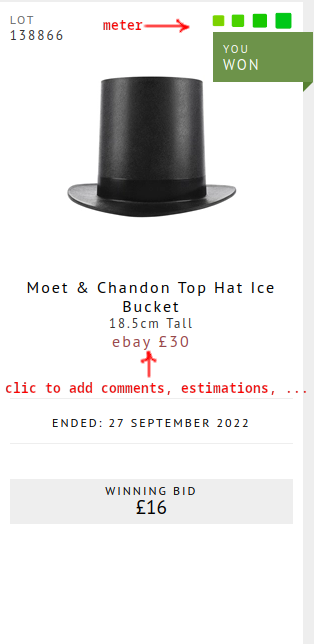
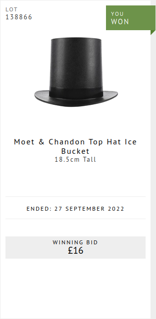
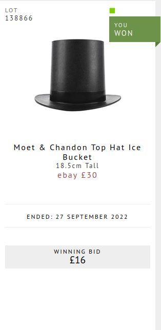

&nbsp;&nbsp;&nbsp;&nbsp;&nbsp;&nbsp;&nbsp;&nbsp;&nbsp;&nbsp;
Before: &nbsp;&nbsp;&nbsp;&nbsp;
After: 

# whisky.auction HUD

Simple javascript overlay to track personal estimations on whisky.auction. Adds a 'google it' link to each item which:

  Opens a search page on past auctions.
  
  
  Opens a google search.
  
  
  Lets you input your own estimated value and displays it accross the website for all identical items.
  
  
  Displays on a meter the difference between your estimation and the current bid + commission + shipping.

  Puts the good deals on your watchlist.
  
  

# chrome INSTALL
Install tampermonkey : https://chrome.google.com/webstore/detail/tampermonkey/dhdgffkkebhmkfjojejmpbldmpobfkfo?hl=en

Visit https://github.com/JorisFouet/auctionHUD/raw/main/whiskyAuctionHUD.user.js

Follow instructions.

# firefox INSTALL
Install greasemonkey : https://addons.mozilla.org/en-GB/firefox/addon/greasemonkey/

Visit https://github.com/JorisFouet/auctionHUD/raw/main/whiskyAuctionHUD.user.js

Follow instructions.
